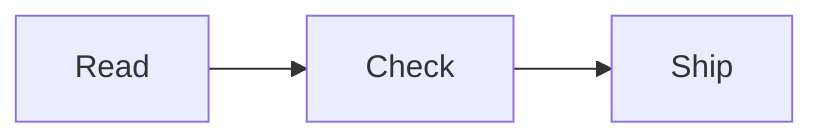
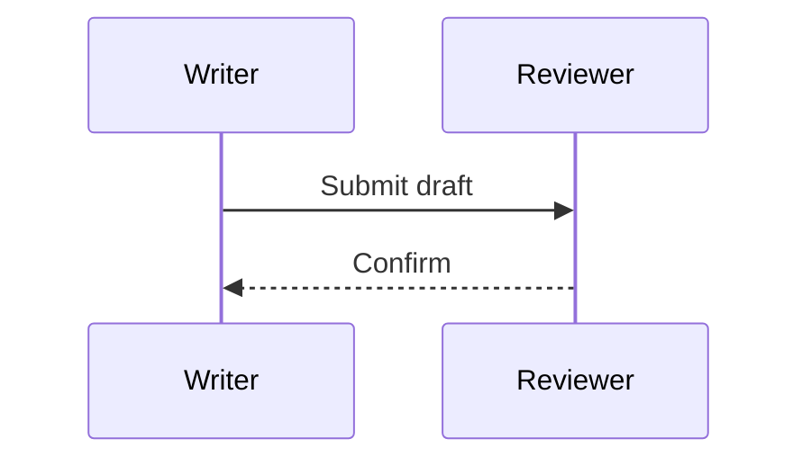
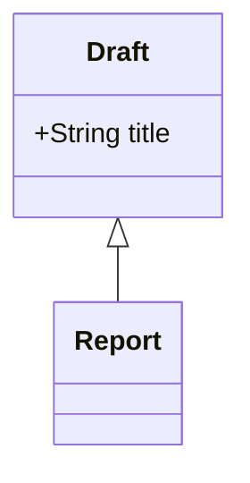
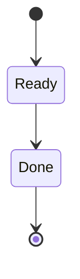
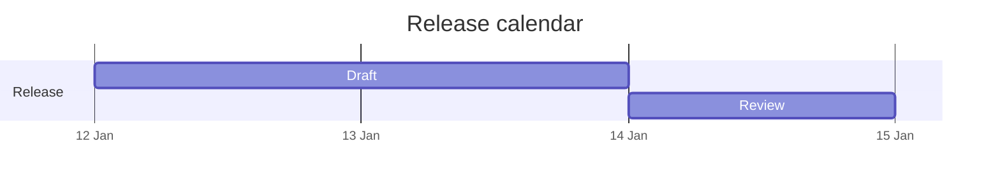
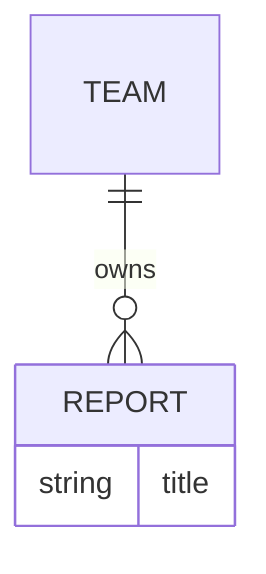

# Release planning fixture

## Flowchart

```mermaid
flowchart LR
  accTitle: Release workflow
  A[Read] --> B[Check] --> C[Ship]
```

## Sequence

```mermaid
sequenceDiagram
  accTitle: Review handoff
  participant A as Writer
  participant B as Reviewer
  A->>B: Submit draft
  B-->>A: Confirm
```

## Class

```mermaid
classDiagram
  accTitle: Document classes
  Draft <|-- Report
  class Draft {
    +String title
  }
```

## State

```mermaid
stateDiagram-v2
  accTitle: Document state
  [*] --> Ready
  Ready --> Done
  Done --> [*]
```

## Gantt

```mermaid
gantt
  accTitle: Release calendar
  title Release calendar
  dateFormat YYYY-MM-DD
  axisFormat %d %b
  tickInterval 1day
  section Release
  Draft :d1, 2026-01-12, 2d
  Review :after d1, 1d
```

## Entity relationship

```mermaid
erDiagram
  accTitle: Report ownership
  TEAM ||--o{ REPORT : owns
  REPORT {
    string title
  }
```

## Broken diagram

```mermaid
flowchart LR
  Draft -->
```
